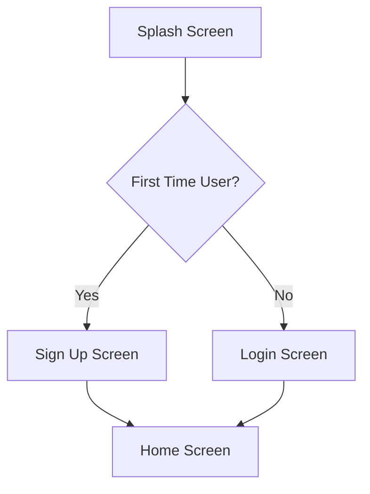
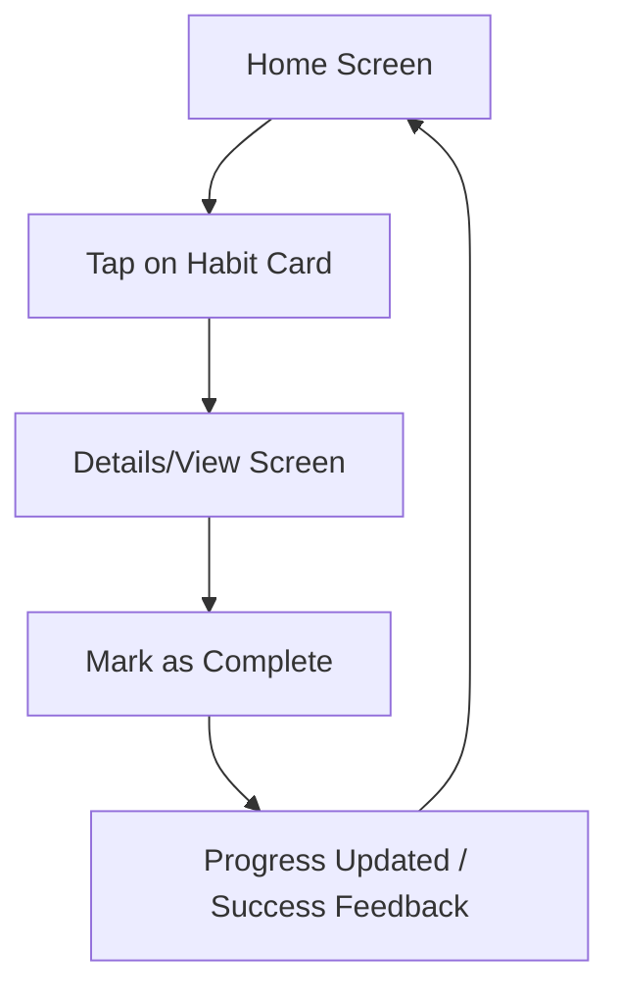
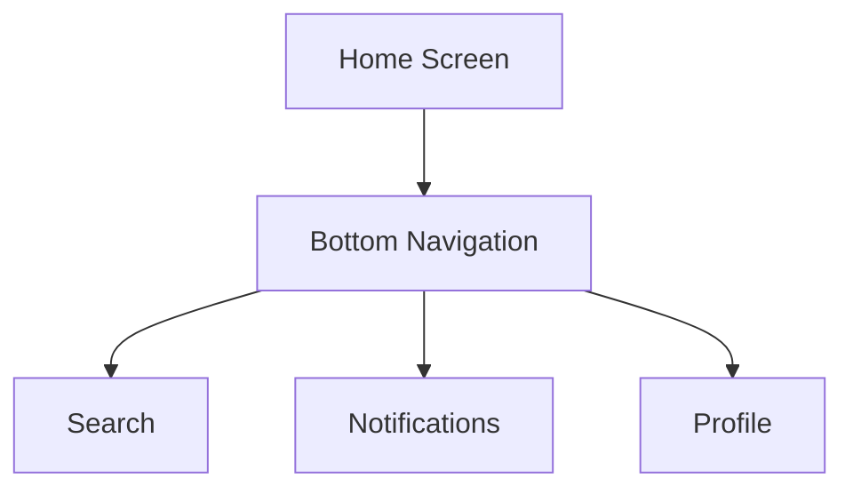
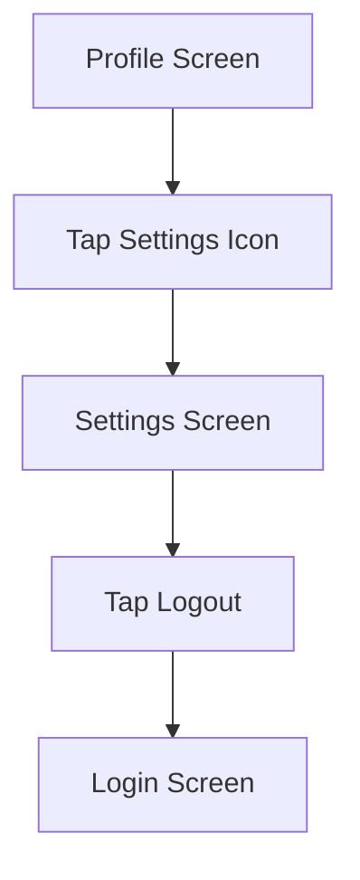

# Mobile App Wireframing Project

## 1. 🔍 User Research

**Project Concept:** "ZenRoutine" - A Smart Habit Tracker & Productivity Hub
**Target Audience:** Young professionals, university students, and freelancers (Age 18-35).
**Research Summary:** 
Our simulated user research indicates that most users abandon productivity apps because they are either too complex to set up or lack satisfying visual feedback for their progress. Users are looking for a friction-free experience where logging a habit or task takes less than 3 seconds.
**User Problems & Needs:**
- **Problem:** Overwhelming interfaces that cause cognitive overload.
- **Problem:** Lack of motivation after initial app download.
- **Need:** A minimalist, clean interface that prioritizes core actions.
- **Need:** Clear visual progression (streaks, charts) to maintain engagement.

---

## 2. 👤 User Personas

### Persona 1: Alex (The Busy Student)
- **Age:** 21
- **Occupation:** University Student
- **Goals:** Keep track of assignment deadlines, build a consistent study habit, and make time for the gym.
- **Pain Points:** Easily distracted, forgets small daily tasks, feels overwhelmed by cluttered UI.
- **User Behavior:** Checks smartphone every 15 minutes, prefers quick one-tap actions, highly visually driven.

### Persona 2: Sarah (The Freelancer)
- **Age:** 30
- **Occupation:** Freelance Graphic Designer
- **Goals:** Separate work hours from personal time, remember to take screen breaks, track reading habits.
- **Pain Points:** Work and personal life blur together, existing tools require too much manual input.
- **User Behavior:** Appreciates clean and modern design, organizes life mostly digitally, values privacy and offline capabilities.

---

## 3. 🔄 User Flow Design

### User Registration / Login Flow

### Main Feature Usage (Logging a Habit)

### Home Screen Navigation

### Settings & Logout Flow

---

## 4. 🧠 Design Thinking Documentation

1. **Empathize:** We started by understanding the target audience. Users expressed frustration with cluttered apps that demand too much cognitive effort. They just want to open the app, log their task, and see their progress.
2. **Define:** Based on insights, we defined the core problem: "Users need a frictionless, visually rewarding way to track daily habits without navigating complex menus."
3. **Ideate:** We brainstormed solutions focusing on a "Mobile-First" and "Minimalist" approach. The idea of large, easy-to-tap cards and a persistent bottom navigation bar emerged as the best layout.
4. **Prototype:** We translated these ideas into low-fidelity, grayscale wireframes. Using abstract shapes and placeholders allows us to focus entirely on layout, hierarchy, and flow without getting distracted by colors and typography.
5. **Test:** The provided interactive prototype is the testing artifact. It allows stakeholders to tap through the screens to validate the user flow and navigational logic before any high-fidelity design or coding begins.

---

## 5. 🎨 Design Guidelines

- **Style:** Low-fidelity, grayscale.
- **Focus:** Information architecture, layout hierarchy, and user flow.
- **Placeholders:** 
  - `[X]` Boxes for images/avatars.
  - Rectangular blocks for text.
  - Simple outlines for buttons.
- **Typography:** Sans-serif, emphasizing varying weights (Bold for headings, Regular for body) to establish hierarchy.

---

## 6. ✨ Modern Mobile App Layout Inspiration

While building these wireframes, several modern design principles were kept in mind to ensure the final product (post-wireframe) will feel current and engaging:
- **Bottom-Heavy Navigation:** Moving critical interactive elements to the bottom half of the screen for easier one-handed use on larger smartphones.
- **Card-Based UI:** Using distinct cards with subtle shadows (simulated by borders in wireframes) to chunk information and make it easily digestible.
- **Micro-Interactions:** The prototype includes smooth fade-in animations between screens, hinting at the dynamic transitions expected in a modern application.
- **Dark Mode Support:** A dark mode theme is integrated into the architecture from day one, allowing users to reduce eye strain, a highly requested feature in modern productivity apps.

---

*Note: Since an AI cannot directly generate proprietary `.fig` or `.xd` files, I have constructed an **Interactive Clickable Web Prototype** (HTML/CSS/JS) located in the `prototype` folder. This fulfills the "Interactive clickable prototype", "Dark mode wireframe concept", and "Simple onboarding flow" bonus features and serves as a highly effective, platform-independent substitute for a standard wireframing tool file.*
